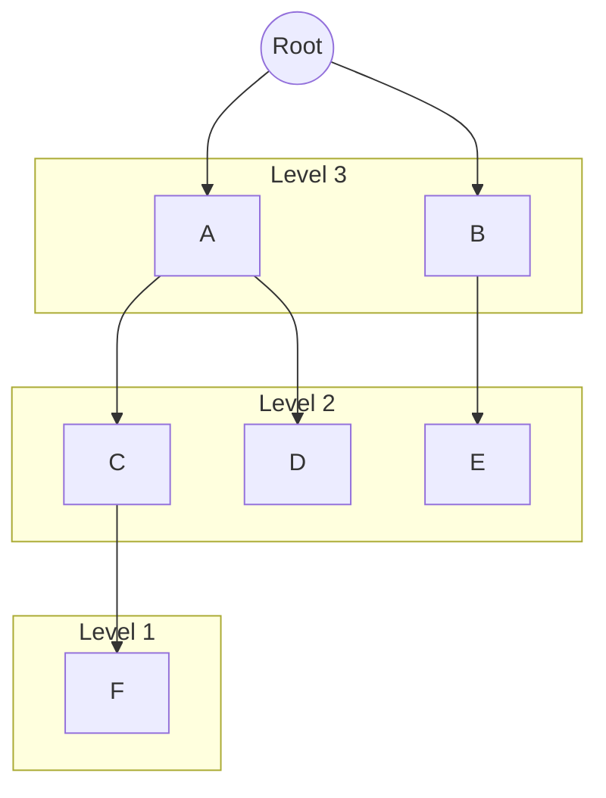

# [Gold IV] 균형 - 22968 

[문제 링크](https://www.acmicpc.net/problem/22968) 

### 성능 요약

메모리: 2020 KB, 시간: 0 ms

### 분류

다이나믹 프로그래밍

### 제출 일자

2026년 2월 6일 18:49:04

### 문제 설명

이진 탐색 트리의 한 종류인 AVL Tree는 "높이 균형 성질"이라는 성질을 이용해 트리의 균형을 맞춘다.

또한, 높이 균형 성질을 만족하는 이진 탐색 트리는 전부 AVL Tree이다.

트리 <mjx-container class="MathJax" jax="CHTML" style="font-size: 109%; position: relative;"><mjx-math class="MJX-TEX" aria-hidden="true"><mjx-mi class="mjx-i"><mjx-c class="mjx-c1D447 TEX-I"></mjx-c></mjx-mi></mjx-math><mjx-assistive-mml unselectable="on" display="inline"><math xmlns="http://www.w3.org/1998/Math/MathML"><mi>T</mi></math></mjx-assistive-mml>$T$</mjx-container>의 모든 내부 정점 <mjx-container class="MathJax" jax="CHTML" style="font-size: 109%; position: relative;"><mjx-math class="MJX-TEX" aria-hidden="true"><mjx-mi class="mjx-i"><mjx-c class="mjx-c1D463 TEX-I"></mjx-c></mjx-mi></mjx-math><mjx-assistive-mml unselectable="on" display="inline"><math xmlns="http://www.w3.org/1998/Math/MathML"><mi>v</mi></math></mjx-assistive-mml>$v$</mjx-container>에 대해, <mjx-container class="MathJax" jax="CHTML" style="font-size: 109%; position: relative;"><mjx-math class="MJX-TEX" aria-hidden="true"><mjx-mi class="mjx-i"><mjx-c class="mjx-c1D463 TEX-I"></mjx-c></mjx-mi></mjx-math><mjx-assistive-mml unselectable="on" display="inline"><math xmlns="http://www.w3.org/1998/Math/MathML"><mi>v</mi></math></mjx-assistive-mml>$v$</mjx-container>의 왼쪽 부트리와 오른쪽 부트리의 높이 차이가 1 이하일 때, <mjx-container class="MathJax" jax="CHTML" style="font-size: 109%; position: relative;"><mjx-math class="MJX-TEX" aria-hidden="true"><mjx-mi class="mjx-i"><mjx-c class="mjx-c1D447 TEX-I"></mjx-c></mjx-mi></mjx-math><mjx-assistive-mml unselectable="on" display="inline"><math xmlns="http://www.w3.org/1998/Math/MathML"><mi>T</mi></math></mjx-assistive-mml>$T$</mjx-container>는 높이 균형 성질을 만족한다고 부른다.

위 그림에서, 왼쪽에 있는 트리는 모든 내부 정점의 왼쪽 부트리와 오른쪽 부트리의 높이가 동일하므로 AVL Tree이다.

가운데에 있는 트리는 5, 6, 8번 정점의 왼쪽 부트리와 오른쪽 부트리의 높이 차이는 1, 나머지 정점들은 0이므로 AVL Tree이다.

오른쪽에 있는 트리는 8번 정점의 왼쪽 부트리와 오른쪽 부트리의 높이 차이가 2이므로 AVL Tree가 아니다.

양의 정수 <mjx-container class="MathJax" jax="CHTML" style="font-size: 109%; position: relative;"><mjx-math class="MJX-TEX" aria-hidden="true"><mjx-mi class="mjx-i"><mjx-c class="mjx-c1D449 TEX-I"></mjx-c></mjx-mi></mjx-math><mjx-assistive-mml unselectable="on" display="inline"><math xmlns="http://www.w3.org/1998/Math/MathML"><mi>V</mi></math></mjx-assistive-mml>$V$</mjx-container>가 주어지면, 최대 <mjx-container class="MathJax" jax="CHTML" style="font-size: 109%; position: relative;"><mjx-math class="MJX-TEX" aria-hidden="true"><mjx-mi class="mjx-i"><mjx-c class="mjx-c1D449 TEX-I"></mjx-c></mjx-mi></mjx-math><mjx-assistive-mml unselectable="on" display="inline"><math xmlns="http://www.w3.org/1998/Math/MathML"><mi>V</mi></math></mjx-assistive-mml>$V$</mjx-container>개의 정점을 사용해서 만들 수 있는 AVL Tree의 최대 높이를 출력하는 프로그램을 작성하자.

### 입력 

 
첫째 줄에 테스트 케이스의 개수 <mjx-container class="MathJax" jax="CHTML" style="font-size: 109%; position: relative;"><mjx-math class="MJX-TEX" aria-hidden="true"><mjx-mi class="mjx-i"><mjx-c class="mjx-c1D447 TEX-I"></mjx-c></mjx-mi></mjx-math><mjx-assistive-mml unselectable="on" display="inline"><math xmlns="http://www.w3.org/1998/Math/MathML"><mi>T</mi></math></mjx-assistive-mml>$T$</mjx-container>가 주어진다.

둘째 줄부터 <mjx-container class="MathJax" jax="CHTML" style="font-size: 109%; position: relative;"><mjx-math class="MJX-TEX" aria-hidden="true"><mjx-mi class="mjx-i"><mjx-c class="mjx-c1D447 TEX-I"></mjx-c></mjx-mi></mjx-math><mjx-assistive-mml unselectable="on" display="inline"><math xmlns="http://www.w3.org/1998/Math/MathML"><mi>T</mi></math></mjx-assistive-mml>$T$</mjx-container>개의 줄에 걸쳐 정점의 개수 <mjx-container class="MathJax" jax="CHTML" style="font-size: 109%; position: relative;"><mjx-math class="MJX-TEX" aria-hidden="true"><mjx-mi class="mjx-i"><mjx-c class="mjx-c1D449 TEX-I"></mjx-c></mjx-mi></mjx-math><mjx-assistive-mml unselectable="on" display="inline"><math xmlns="http://www.w3.org/1998/Math/MathML"><mi>V</mi></math></mjx-assistive-mml>$V$</mjx-container>가 한 줄에 하나씩 주어진다.

### 출력 

 
총 <mjx-container class="MathJax" jax="CHTML" style="font-size: 109%; position: relative;"><mjx-math class="MJX-TEX" aria-hidden="true"><mjx-mi class="mjx-i"><mjx-c class="mjx-c1D447 TEX-I"></mjx-c></mjx-mi></mjx-math><mjx-assistive-mml unselectable="on" display="inline"><math xmlns="http://www.w3.org/1998/Math/MathML"><mi>T</mi></math></mjx-assistive-mml>$T$</mjx-container>개의 줄에 걸쳐 정답을 출력한다.

각 테스트 케이스마다, 최대 <mjx-container class="MathJax" jax="CHTML" style="font-size: 109%; position: relative;"><mjx-math class="MJX-TEX" aria-hidden="true"><mjx-mi class="mjx-i"><mjx-c class="mjx-c1D449 TEX-I"></mjx-c></mjx-mi></mjx-math><mjx-assistive-mml unselectable="on" display="inline"><math xmlns="http://www.w3.org/1998/Math/MathML"><mi>V</mi></math></mjx-assistive-mml>$V$</mjx-container>개의 정점으로 만들 수 있는 AVL Tree의 최대 높이를 출력한다.

---

### Idea

#### 처음 생각

처음엔 수식적으로 접근했다. ...아예 잘못 생각함.  

처음엔 완전이진트리를 베이스로 생각해서, AVL 트리의 노드 수가 반드시 2^h < 노드수 < 2^(h+1) 에 속할 것이라고 생각했다.
 

🛑 그러나 AVL 트리는 튀어나온(가장 깊은) 노드를 제외했을 때 포화이진트리일 필요가 없다. !!  

예시)   

---

#### 작은 트리부터 시작, 큰 트리를 만들기

- 그럼 어떻게 생각해야 할까  
문제에 나와 있듯이, `AVL` 트리는 모든 노드에 대해서 왼쪽 서브트리와 오른쪽 서브트리의 높이 차이가 `1 이하` 이기만 하면 된다.  

> 높이가 `n`인 트리, 높이가 `n+1` 인 트리를 생각해 보면  
> 높이가 `n+2` 인 트리는 높이가 `n`, `n+1` 인 트리를 __각각 루트의 오른쪽/왼쪽 서브트리로 갖는__ 트리가 된다.  
  
> 💡 높이가 `n` 인 트리, 높이가 `n+1` 인 트리는 이미 `AVL` 트리를 만족하고, 두 서브트리의 높이 차는 `1` 이기 때문에 __높이가 `n+2` 인 트리도 `AVL` 트리를 만족__ 한다.  
  
-->  
각 높이(`h`) 를 만드는 데 필요한 최소 노드 수를 저장하는 배열을 만들고, 미리 계산해 값을 저장해 둔다.  
(이 문제에서는 테스트 케이스로 정점의 최대 갯수가 주어져 최대 높이가 `42` 라는 것을 알 수 있었고, 넉넉히 높이 `50` 까지 계산해 두었다.)
 

(`배열에 저장된 수 (최소 노드 수)`) 가 (`입력받은 노드 수`)보다 "커지는" 순간, __바로 '이전' 인덱스__ 를 출력한다.  
(반대로 `입력받은 노드 수` 가 `배열에 저장된 수` 보다 커지는 순간은 사용할 수 없다. 애초에 큰 상태로 시작하기 때문에...)  
